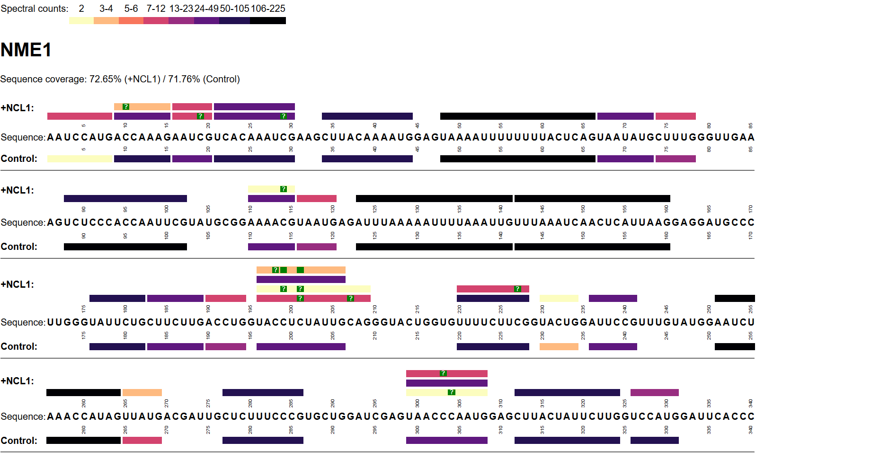

# NucleicAcidSearchEngine-coverage-plot
Code for generating sequence coverage plots from NucleicAcidSearchEngine results

NucleicAcidSearchEngine (NASE) is a sequence database search engine for tandem mass spectrometry data of RNA oligonucleotides. It is part of [OpenMS](https://github.com/OpenMS/OpenMS). Detailed information about NASE, including some applications, was published in [Nature Communications](https://www.nature.com/articles/s41467-020-14665-7).

This repository contains R code to generate sequence coverage visualisations for NASE search results. Given one or two NASE output file(s) in (RNA-variant) mzTab format, an HTML file is produced as output. Example plot:



Usage:
```r
source("plot_coverage_full.R")
openms.chemistry.dir <- "..." # adjust path depending on your OpenMS installation
mztab1 <- read.mzTab("NASE_output1.mzTab")
mztab2 <- read.mzTab("NASE_output2.mzTab")
## insert optional filtering here...
html <- make.coverage.html(mztab1, mztab2)
cat(html, file="coverage_plot.html")
```

See documentation in the code for more details.
